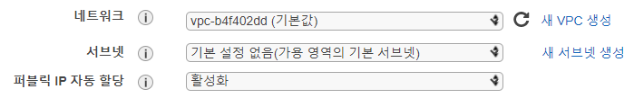
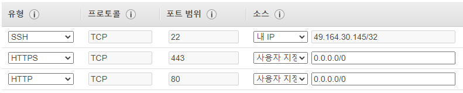
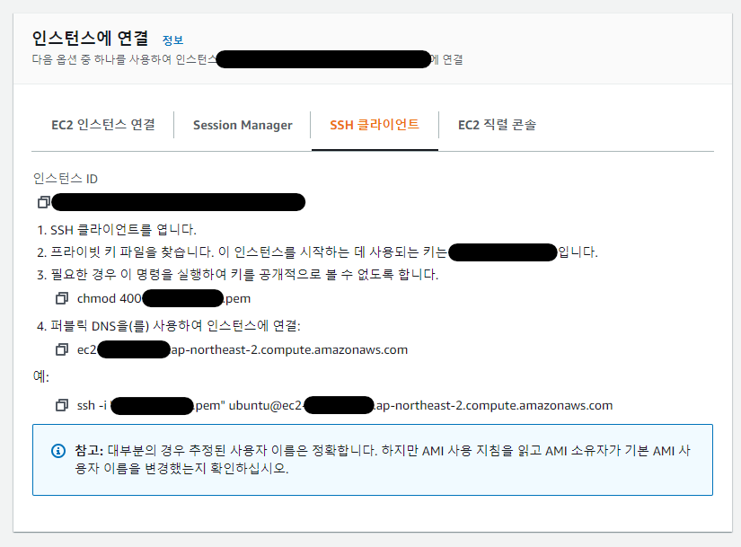

# EC2로 Next.js 배포하기

## EC2 인스턴스 생성하기

1. 먼저 EC2 인스턴스를 생성해야 한다. EC2 페이지에 접속해서 [인스턴스 시작] 버튼을 클릭한다. 
[https://ap-northeast-2.console.aws.amazon.com/ec2/v2/home](https://ap-northeast-2.console.aws.amazon.com/ec2/v2/home)
2. 원하는 OS 이미지를 선택한다. 무난한 **Ubuntu Server 20.04**를 선택하는 것을 추천한다.
3. 다음으로 인스런스 유형을 프로젝트 규모에 맞추어 선택하면 된다. **t2.micro**가 무난한 선택이다. [다음: 인스턴스 세부 정보 구성] 버튼을 클릭한다.
4. "단계 3: 인스턴스 세부 정보 구성"에서 VPC와 서브넷, 그리고 퍼블릭 IP 자동 할당 설정을 확인한다.
    - **VPC**는 AWS에서 해당 사용자만 접근할 수 있는 네트워크이다. 여러 EC2 인스턴스나 AWS의 다른 서비스끼리 자체적으로 네트워크를 구성할 수 있다. **서브넷**으로는 VPC 안에서 더 작은 단위로 그룹을 형성할 수 있다.
    - 만약 EC2 인스턴스를 하나만 실행시킬 것이라면 크게 신경 쓰지 않아도 된다. 하지만 여러 인스턴스 간의 네트워크 구성이 필요하다면 이에 맞추어 적절하게 설정해야 한다.
    - VPC는 AWS를 사용하여 인프라를 구성할 때 꼭 알아야 하는 중요한 개념이므로 별도로 공부해야 한다.
    - **퍼블릭 IP 자동 할당**을 **활성화**하면 외부에서 접근할 수 있는 IP를 자동으로 할당해준다. EC2 인스턴스를 그냥 생성한다면 외부에서 접근할 수 없는 인스턴스로 생성된다.
    - 배포를 하려면 외부에서 접근할 수 있어야 하므로 활성화를 선택해준다.
    
    
    
5. "단계 5: 태그 추가"에서 Name을 키로 하면 인스턴스의 이름을 지정해줄 수 있다.
    
    
    
6. "단계 6: 보안 그룹 구성"에서 보안 그룹을 생성하면서 열어둘 포트와 IP를 지정할 수 있다. EC2를 사용한다면 Ubuntu 자체 방화벽(ufw)을 비활성화하고 AWS에서의 설정을 사용하는 것이 편하다.
    
    유형에서 하는 프로토콜과 열고 싶은 포트를 입력하면 된다. 해당 포트를 열 때, "소스" 입력을 통해 접근 가능한 IP도 별도로 설정할 수 있다. `0.0.0.0/0`은 모든 IP 범위에서 허용한다는 의미이다.
    
    
    
7. 키 페어 생성

## SSH 접속하기

AWS에서 인스턴스에 연결하는 방법에 대해서 설명해주고 있다. 가장 추천하는 방법은 SSH 클라이언트로 접속하는 것이다.



Windows에서 SSH 접속할 때는 주로 PuTTY를 사용하는데, PowerShell을 이용하면 `ssh` 명령어와 pem 형식의 인증서를 그대로 사용할 수 있다. 개인적으로 [PowerShell Core](https://github.com/PowerShell/PowerShell)을 설치해서 사용하는 것을 추천한다.

## 서버 설정

Next.js 프로젝트를 배포해야 하므로 다음의 패키지 혹은 프로그램을 설치해야 한다.

- Node.js (nvm)
- 사용했던 패키지 매니저(e.g. npm, yarn),
- pm2 (무중단으로 Node 프로세스를 유지해주는 관리 도구)
- NGINX (리버스 프록시 및 HTTPS 설정)
- Certbot (Let's Encrypt 인증서 발급 도구)

1. Node.js는 [**Node Version Manager**](https://github.com/nvm-sh/nvm)를 통해서 설치하는 것이 편리하므로, NVM을 설치한다. 먼저, 다음의 명령어로 설치 스크립트를 다운로드 받아서 실행한다.
    
    ```bash
    curl -o- https://raw.githubusercontent.com/nvm-sh/nvm/v0.38.0/install.sh | bash
    ```
    
    nvm이 잘 설치되었다면 다음 명령어를 입력했을 때 `nvm`이 출력될 것이다. 만약 뜨지 않는다면 다시 접속하거나 Bash를 다시 실행해서 시도해본다. (`source .bashrc`)
    
    ```bash
    command -v nvm
    ```
    
    Node.js 홈페이지에 들어가 현재 버전을 확인하고, 해당 버전으로 설치한다. 프로젝트 배포 시 타겟 버전이 있다면, 해당 버전으로 설치한다.
    
    ```bash
    nvm install 14.18.0
    nvm use 14.18.0
    ```
    
2. Yarn을 설치해야 한다면 Yarn도 설치한다.
    
    ```bash
    npm i -g yarn
    yarn --version # yarn이 잘 설치되었는지 확인한다
    ```
    
3. 다음으로 [pm2](https://pm2.keymetrics.io/)를 설치한다. `yarn global add`를 통해서 설치하려면 Yarn 설치 이후 별도로 PATH 설정을 해주어야 올바르게 경로를 인식한다. 설정이 번거롭다면 npm을 통해서 설치해주면 된다.
    
    ```bash
    npm i -g pm2
    ```
    
4. 배포할 프로젝트 파일들을 가져온다. 이 글에서는 `git clone`을 이용한다.
5. 의존성 패키지들을 설치한다.
    
    ```bash
    yarn
    # or
    npm i
    ```
    
6. Next.js 프로젝트를 빌드한다.
    
    ```bash
    yarn build
    ```
    
7. pm2를 통해서 프로젝트 배포를 시작한다.
    - `-w` : 파일의 변경 시 자동으로 재시작되는 옵션
    - `-i 0` : CPU 코어 수만큼 프로세스를 생성하는 클러스터 모드
    
    ```bash
    pm2 start yarn -w -i 0 --name "next" -- start
    ```
    
    - pm2는 Node.js 프로세스 매니저로 다음과 같은 특징을 가지고 있다.
        - 백그라운드에서도 실행을 유지시켜준다.
        - 에러가 발생해도 자동으로 다시 시작된다.
        - 클러스터 모드를 통해 실행하면, CPU 코어 수만큼 프로세스가 생성되어, 싱글 스레드인 Node.js에서도 최대 코어 수만큼 요청을 처리할 수 있게 설정된다.

## NGINX 리버스 프록시, 도메인, HTTPS 적용

- 지금은 프로젝트가 3000 포트에서 실행되고 있다. 80 포트에서 실행되도록 할 수도 있지만, NGINX의 리버스 프록시를 통해 80 포트로 배포되도록 처리할 수 있다.
- WAS에서 서버 설정을 할 경우, WAS마다 설정하는 법이 제각각인데다 설정 방법이 비교적 복잡하기 때문에 NGINX 리버스 프록시를 적용하는 것이 좋다.
- 리버스 프록시를 적용하면 NGINX의 기능을 사용할 수 있기 때문에, NGINX를 통해 서버 설정을 좀 더 편하게 할 수 있다. 예를 들어, 도메인 설정이나 HTTPS 적용도 비교적 편하게 할 수 있다.
- 또한 WAS를 그대로 배포했을 때 DB 서버가 노출될 수 있는 문제를 막을 수 있다.
1. 먼저 EC2 인스턴스의 퍼블릭 IP 주소를 가지고 도메인을 설정해야 한다. 도메인을 구입한 사이트에서 A 레코드에 해당 IP 주소를 입력하고 저장하면 된다.
2. NGINX를 설치한다.
    
    ```bash
    sudo apt-get install nginx -y
    nginx -v # 잘 설치되었는지 확인한다.
    ```
    
3. NGINX 설정을 위한 파일을 편집하기 위해 설정 파일을 연다. 여기서는 기본 생성된 설정 파일인 `/etc/nginx/sites-available/default`를 열었다.
    - NGINX 설정은 여러 파일들을 분리하여 설정할 수도 있다.
    - 개인적으로 `/etc/nginx/sites-available`에서 설정 파일들을 편집하고 `/etc/nginx/sites-enabled`에 심볼릭 링크를 생성하는 방식으로 서버 설정 파일들을 관리하는 것을 선호한다.
    
    ```bash
    sudo vim /etc/nginx/sites-available/default
    ```
    
4. 내용을 모두 지우고, 다음과 같이 리버스 프록시 설정을 작성한다.
    
    `server_name`에 설정해두었던 도메인 주소를 입력한다.
    
    ```bash
    server {
            listen 80 default_server;
            listen [::]:80 default_server;
    
            server_name <도메인 주소>;
    
            location / {
                    proxy_pass http://127.0.0.1:3000;
                    proxy_set_header Host $host;
                    proxy_set_header X-Real-IP $remote_addr;
                    proxy_set_header X-Forwarded-For $proxy_add_x_forwarded_for;
                    proxy_set_header X-Forwarded-Proto $scheme;
            }
    }
    ```
    
5. 다음 명령어로 NGINX 설정이 올바른지 확인한 다음, NGINX 서비스를 재시작한다.
    
    ```bash
    sudo nginx -t
    sudo systemctl reload nginx
    ```
    
6. 이제 웹 브라우저를 통해 설정한 도메인 주소로 접속해보면 페이지가 잘 나오는 것을 확인할 수 있다. 마지막으로 HTTPS를 적용해보자.
7. Certbot을 설치한다.
    
    ```bash
    sudo apt-get install python3-certbot-nginx
    ```
    
8. 다음 명령어로 인증서 발급을 시작한다.
    
    ```bash
    sudo certbot --nginx
    ```
    
    - 처음에 본인의 이메일을 입력하라고 나온다. 본인의 이메일을 입력한다. 인증서 기간이 얼마 남지 않았을 때 메일을 보내준다.
        
        ```
        Enter email address (used for urgent renewal and security notices) (Enter 'c' to
        cancel):
        ```
        
    - 다음에는 Terms of Service에 동의하냐고 묻는다. Y를 입력한다.
        
        ```
        Please read the Terms of Service at
        https://letsencrypt.org/documents/LE-SA-v1.2-November-15-2017.pdf. You must
        agree in order to register with the ACME server at
        https://acme-v02.api.letsencrypt.org/directory
        - - - - - - - - - - - - - - - - - - - - - - - - - - - - - - - - - - - - - - - -
        (A)gree/(C)ancel: A
        ```
        
    - EFF로부터 이메일 뉴스레터를 수신할 것인지 묻는다. 자유롭게 정한다.
        
        ```
        - - - - - - - - - - - - - - - - - - - - - - - - - - - - - - - - - - - - - - - -
        Would you be willing to share your email address with the Electronic Frontier
        Foundation, a founding partner of the Let's Encrypt project and the non-profit
        organization that develops Certbot? We'd like to send you email about our work
        encrypting the web, EFF news, campaigns, and ways to support digital freedom.
        - - - - - - - - - - - - - - - - - - - - - - - - - - - - - - - - - - - - - - - -
        (Y)es/(N)o: N
        ```
        
    - 어떤 도메인에 대해 인증서를 발급할 것인지 묻는다. 해당 도메인의 번호를 입력한다.
        
        ```
        Which names would you like to activate HTTPS for?
        - - - - - - - - - - - - - - - - - - - - - - - - - - - - - - - - - - - - - - - -
        1: example.domain.com
        - - - - - - - - - - - - - - - - - - - - - - - - - - - - - - - - - - - - - - - -
        ```
        
    - 이후 인증 과정을 잘 거치면 다음 메시지가 출력된다.
        
        ```
        Please choose whether or not to redirect HTTP traffic to HTTPS, removing HTTP access.
        - - - - - - - - - - - - - - - - - - - - - - - - - - - - - - - - - - - - - - - -
        1: No redirect - Make no further changes to the webserver configuration.
        2: Redirect - Make all requests redirect to secure HTTPS access. Choose this for
        new sites, or if you're confident your site works on HTTPS. You can undo this
        change by editing your web server's configuration.
        - - - - - - - - - - - - - - - - - - - - - - - - - - - - - - - - - - - - - - - -
        Select the appropriate number [1-2] then [enter] (press 'c' to cancel): 2
        ```
        
        HTTP로 접속했을 때, HTTPS로 자동 리다이렉트되도록 설정할 것인지 묻는 옵션이다. 2번을 선택하면 Certbot에서 NGINX 설정을 알아서 바꿔준다.
        
        별도로 설정하고 싶다면 1을 입력해서 설정을 건드리지 못하게 하면 된다. 개인적으로는 2번을 선호한다.
        
        이렇게 Let's Encrypt 인증서까지 발급받았다. 발급된 인증서는 90일 동안 유효하다.
        
9. 마지막으로 인증서가 만료되기 전에 알아서 갱신되도록 Crontab을 설정할 것이다. 먼저 Crontab 설정 파일을 연다. 설정 파일을 열 때 편한 편집기를 고르라는 메시지가 뜨는데, 편한 편집기로 고르면 된다.
    
    ```
    sudo crontab -e
    ```
    
10. 최하단에 다음 설정을 추가한다. 이렇게 설정하면 매월 1일 오후 6시마다 인증서를 갱신하고 NGINX를 재시작하는 명령어가 실행된다.
    
    ```
    0 18 1 * * certbot renew --renew-hook="sudo systemctl restart nginx"
    ```
    

**이렇게 모든 설정이 끝났다! 🥳**
