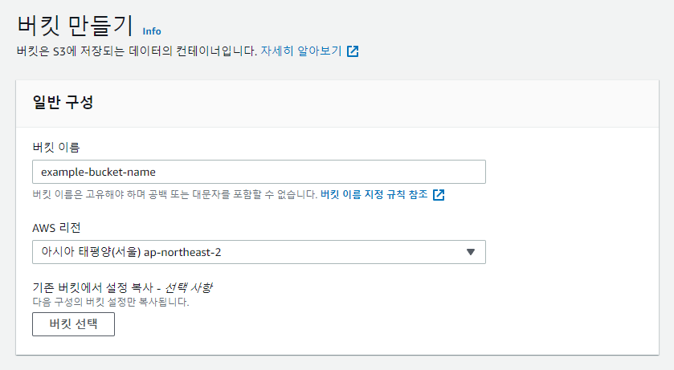

# S3 + CloudFront로 정적 웹 사이트 배포하기

AWS S3와 Cloudfront를 이용하여 정적 웹 사이트를 배포하는 과정이다.

- 이 글에서는 AWS CLI를 사용하지 않는다.

## 준비

- AWS Console에 로그인한다. 계정이 없다면 회원가입을 하고, 결제할 수 있는 카드를 등록해야 한다.
- 배포하고자 하는 정적 웹 페이지 파일들을 준비한다. 만약 React, Vue와 같은 프론트엔드 라이브러리를 사용하고 있다면, 프로젝트를 빌드하여 준비한다.

## S3 버킷 생성 및 배포 파일 업로드

S3에 데이터를 저장하기 위해서는 먼저 S3 버킷을 생성해야 한다.

### **버킷 (Bucket)**

- 데이터들을 담는 하나의 스토리지 공간이라고 할 수 있다. AWS에서는 **객체에 대한 컨테이너**라고 설명하고 있다.

### 객체 (Object)

- 저장되는 파일을 의미한다. AWS에서는 **파일과 해당 파일을 설명하는 모든 메타데이터**라고 설명하고 있다.
- S3에서는 Key-Value 형태로 데이터가 저장된다.
    - Key에는 객체에 할당한 이름이다. e.g. `images/logo.svg`, `document.pdf`
    - Value에 실제 데이터가 담긴다.

1. AWS Console에서 S3 서비스 페이지에 접속한 뒤, [버킷 만들기] 버튼을 클릭한다. ([https://s3.console.aws.amazon.com/s3/home](https://s3.console.aws.amazon.com/s3/home))
2. 원하는 버킷 이름을 입력하고, AWS 리전을 선택한다. 지리적으로 가까운 리전을 선택하는 것이 좋다.
    
    
    
3. S3 버킷에 직접 접근시키는 것이 아니라, CloudFront를 통해서 캐시된 CDN 서버에 접근시킬 것이기 때문에 **모든 퍼블릭 액세스 차단**에 체크한다.
    
    
    
4. 나머지는 기본 설정으로 두고 [버킷 만들기] 버튼을 클릭하여 버킷을 생성한다.
    - **버킷 버전 관리** : 업로드한 파일들의 버저닝이 필요할 때 활성화한다.
    - **태그 :** 결제 대시보드에서 비용 추적을 할 수 있는 이름을 작성해줄 수 있다.
    - **기본 암호화** : 업로드한 파일들을 암호화하여 저장할 때 활성화한다. 암호화를 해서 파일을 저장하게 된다면 암호화/복호화 과정에 시간이 걸리며, 정적으로 배포할 파일이기 때문에 암호화할 필요가 없으므로 비활성화한다.
5. 정적 웹 사이트를 호스팅할 것이기 때문에 추가 설정이 필요하다. [속성] 탭을 클릭한 뒤, 페이지 최하단에 **정적 웹 사이트 호스팅** 섹션에서 [편집] 버튼을 클릭한다.
6. 정적 웹 사이트 호스팅을 **활성화**하고 **인덱스 문서** 파일명을 입력해준 뒤 [변경 사항 저장] 버튼을 클릭하여 설정을 완료한다.
    
    
    
7. 생성한 버킷 페이지로 이동한 뒤, [업로드] 버튼을 클릭하여 배포하고자 하는 정적 파일들을 업로드한다.
    
    
    
8. 배포하고자 하는 파일을 추가한 뒤, 하단의 [업로드] 버튼을 클릭하여 업로드한다.
    
    
    
    업로드 상태가 상단에 나타날 것이며, 업로드가 끝나면 "업로드 성공"이라는 문구를 확인할 수 있다.
    
    
    
    버킷 페이지로 돌아오면 업로드된 것을 확인할 수 있다.
    
    
    

## CloudFront 배포 생성 및 설정

- S3에 업로드한 정적 파일들을 CDN을 통해 배포하기 위해서 CloudFront 배포를 설정해야 한다.
1. AWS Console에서 CloudFront 페이지에 접속한 뒤, [배포 생성]버튼을 클릭한다. ([https://console.aws.amazon.com/cloudfront/v3/home](https://console.aws.amazon.com/cloudfront/v3/home))
2. 먼저 원본 도메인을 선택한다. 앞에서 생성했던 S3 버킷 이름의 도메인을 선택한다.
    
    
    
3. "S3 버킷 액세스 항목"에서 **OAI 사용**에 체크하고 [새 OAI 생성] 버튼을 클릭하여 OAI를 생성해준다. 이름은 기본값으로 주면 된다.
    
    버킷 정책은 **예, 버킷 정책 업데이트**를 선택한다.
    
    
    
4. Origin Shield를 활성화하고 원하는 리전을 선택한다. 지리적으로 가까운 리전을 선택하는 것이 좋다.
    
    
    
    - [Origin Shield](https://docs.aws.amazon.com/ko_kr/AmazonCloudFront/latest/DeveloperGuide/origin-shield.html)는 2020년 10월에 발표된 새로운 기능으로, CloudFront에서 캐싱 계층을 하나 더 추가하여 사용자(클라이언트)와 엣지 서버간의 거리를 줄이는 기능이다. 캐시 적중률을 높이고 오리진 서버의 부하를 줄여주어 로드 속도를 향상시키는 효과가 있다.
    - Origin Shield를 활성화하면 요청이 Origin Shield를 경유할 때마다 비용이 추가로 발생된다.
        
        
        
5. 자동으로 객체 압축을 **Yes**로 설정한다. 요청할 리소스의 파일 크기를 비약적으로 줄여줄 수 있다.
6. 뷰어 프로토콜 정책는 **Redirect HTTP to HTTPS**로 설정한다. 이렇게 설정하면 HTTP 프로토콜로 접속 시 자동으로 HTTPS로 리다이렉트된다.
7. 허용된 HTTP 방법은 **GET, HEAD**로 설정한다. 정적 리소스를 배포할 것이기 때문에 다른 HTTP Method를 허용하지 않아도 된다.
    
    
    
8. 캐시 키 및 원본 요청은 **CachingOptimized**를 선택한다. 대부분의 상황에서 적절한 캐시 정책을 바로 적용할 수 있다.
    - 만약 캐시를 비활성화하여 변경사항을 바로바로 확인하고 싶다면 **CachingDisabled**를 선택한다.
    - 만약 별도의 캐시 정책을 설정하려면 [정책 생성] 링크를 통해 새로운 캐시 정책을 설정하고 생성하고 나서 적용하면 된다.

9. 가격 분류를 설정한다. 보통 **모든 엣지 로케이션에서 사용(최고의 성능)**을 사용하면 되지만, 비용을 절약해야 하는 상황이거나 서비스 지역 타겟이 정해져 있을 때 적절한 항목을 선택하면 된다.

10. 커스텀 도메인을 설정하려면 대체 도메인 이름(CNAME)을 입력한다. 구입한 도메인을 적용하고 싶다면 이 항목에 원하는 도메인 이름을 입력하면 된다.
    - CloudFront 배포를 생성하고 나면, 구입한 도메인 서비스에서 CNAME에 CloudFront에서 기본 생성된 도메인 URL(e.g. d111111abcdef8.cloudfront.net)을 입력하여 설정해야 한다.

11. 커스텀 도메인을 설정했다면 SSL 인증서를 요청해서 HTTPS로 올바르게 접속될 수 있게 설정해야 한다. [인증서 요청] 링크를 눌러 안내에 따라 도메인에 맞는 인증서를 생성하고 선택한다.

12. 기본값 루트 객체에 인덱스 페이지의 파일명을 입력한다. `/`는 입력하면 안 된다.
    
    
    
13. 기타 설정은 기본으로 두고 [배포 생성]을 클릭하면 생성이 완료된다.
- 만약 React와 같은 SPA를 배포하는 상황이라면 404 Fallback Redirect 설정을 해주어야 한다. [오류 페이지] 탭에서 [사용자 정의 오류 응답 생성] 버튼을 누른 후, 다음과 같이 입력하고 생성해주면 된다.
    - HTTP 오류 코드 → `404`
    - 오류 응답 사용자 정의 → 예
    - 응답 페이지 경로 → `/index.html`
    - HTTP 응답 코드 → `200`
    
    
    
14. 생성된 배포 도메인 이름으로 접속해서 배포가 잘 진행되었는지 확인한다.

**이렇게 모든 설정이 완료되었다! 🎉**

## 참고

- S3에 있는 리소스를 새로 업로드하고 캐시를 무효화해야할 때, CloudFront에 있는 [무효화] 탭에서 무효화를 생성하면 캐시를 바로 무효화하고 새로 캐싱을 진행시킬 수 있다.
    
    
  